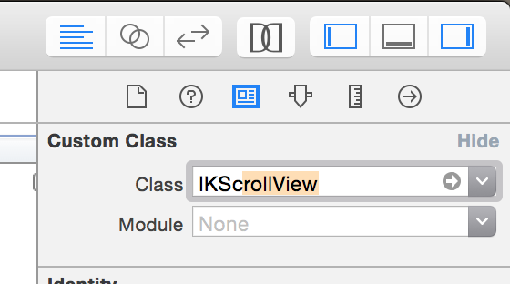
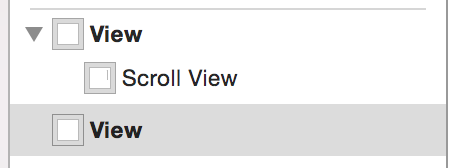
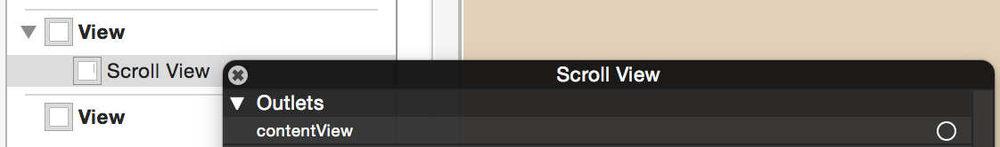
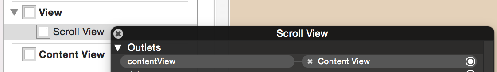
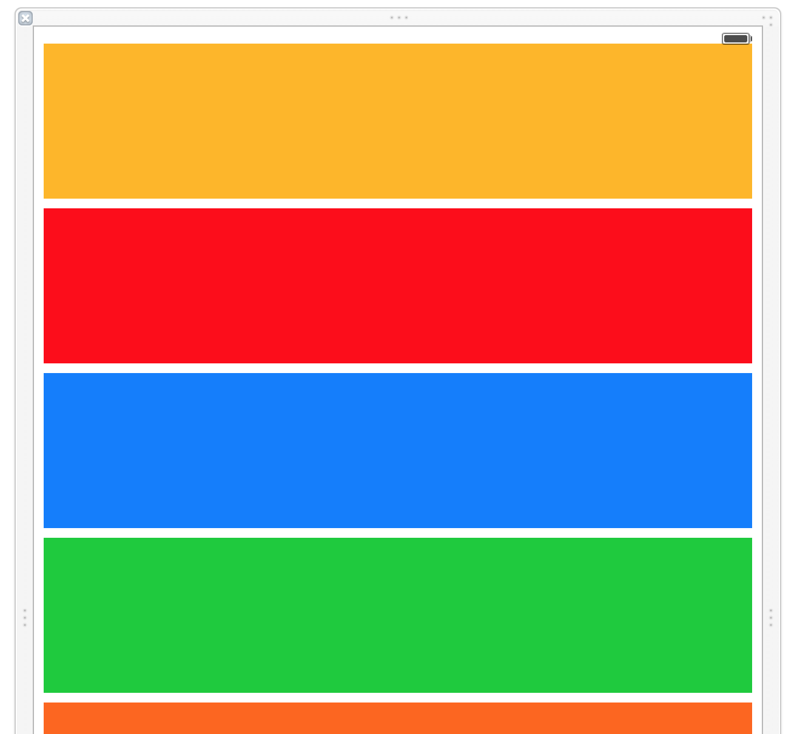
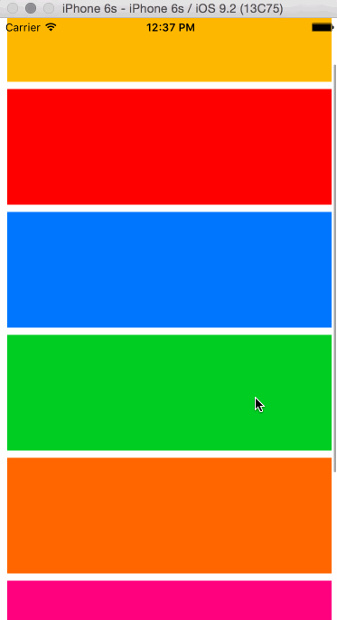

# IKScrollView

## What does it do?
If you have ever struggled to get autolayout to play nice with a `UIScrollView` or just given up entirely and done it in code instead then you might be interested in `IKScrollView`. It allows you to _easily_ use a scrollview with autolayout.

## Using IKScrollView
Using `IKScrollView` is very simple and requires 0 to 1 line of code.

### Adding a scroll view to your view controller 
Add a `UIScrollView` to your view controller and change its class type to `IKScrollView`.




### Add Content View
Add a free floating `UIView` to your view controller. (i.e. a view that is not part of the view hierarchy). We add this outside the view controller hierarchy so that nothing interferes with its autolayout constraints.



### Connect Outlet
Connect the outlet from your `IKScrollView`'s `contentView` property to the content view.





### Build the Content View
Build your content view with autolayout however you want just like a normal interface! In the example here my content view is designed for vertical scrolling (the default for `IKScrollView`).



### Profit! :)
 


# Size Matching
`IKScrollView` allows you to alter how the content view is sized with the `sizeMatching` property. The possible values are:

- `SizeMatching.Width`: The content view will keep its height and be sized to the width of the `IKScrollView` (This is the default setting)
- `SizeMatching.Height`: The content view will keep its width and be sized to the height of the `IKScrollView`
- `SizeMatching.Both`: The content view will be sized to match the width and height of the `IKScrollView`
- `SizeMatching.None`: No resizing will happen to the content view
- `SizeMatching.Dynamic`: Allows you to supply a closure for the width and height that is used to size the content, eg:
```
myScrollView.sizeMatching = .Dynamic(
  width: { self.view.bounds.size.width },
  height: { calculateScrollHeight() }
)
```

# Installation
Install via cocoapods by adding the following to your Podfile

```
pod "IKScrollView", "~>1.0"
```

or manually by adding `IKScrollView.swift` to your project.

# The rest...
There is an included app so you can see it in action.
